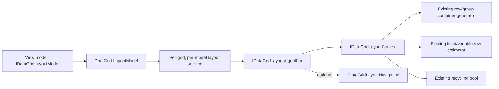

# Model-based layouts

ProDataGrid can arrange its row containers as a virtualized stack, a non-virtualizing stack, a uniform grid, or a variable-size wrap layout. Set `DataGrid.LayoutModel` to opt in. A `null` model keeps the classic vertical-list implementation.

The layout changes only spatial realization and arrangement. The same DataGrid continues to own columns, cells, selection, editing, filtering, sorting, grouping, row-height estimates, container preparation, and recycling.

> [!IMPORTANT]
> Model layouts use the logical scrolling presenter. Set `UseLogicalScrollable="True"`. Generated views do this automatically whenever they configure or bind a layout model.

## Architecture



An `IDataGridLayoutModel` is configuration and an algorithm factory. Each presenter keeps a session for every model instance it has seen. Switching back to a previous instance reuses its bounded state instead of rebuilding it. The active algorithm is initialized and uninitialized at attachment and switching boundaries.

The layout context exposes only the mechanics needed by an algorithm:

- item count and visible realization rectangle;
- logical scroll offset and recommended anchor;
- estimated item sizes and major-axis offsets;
- get-or-create and recycle operations for DataGrid-owned containers;
- bounds recording for realized items;
- one per-session `LayoutState` object.

Layout item indices describe the visible layout sequence. When grouping is active, that sequence includes visible group headers and footers. DataGrid translates collection-view row indices at the navigation boundary; custom algorithms must not treat an index as a data-source identity.

## Runtime switching

Keep model instances on the view model and bind the selected instance:

```csharp
public sealed class ResultsViewModel
{
    public IDataGridLayoutModel ListLayout { get; } =
        new DataGridStackLayoutModel { Spacing = 2 };

    public IDataGridLayoutModel TileLayout { get; } =
        new DataGridUniformGridLayoutModel
        {
            MinItemWidth = 240,
            MinItemHeight = 72,
            MinColumnSpacing = 8,
            MinRowSpacing = 8
        };

    public IDataGridLayoutModel LayoutModel { get; set; }
}
```

```xml
<DataGrid ItemsSource="{Binding Items}"
          LayoutModel="{Binding LayoutModel}"
          UseLogicalScrollable="True" />
```

Do not construct a new model from a converter on every binding evaluation. Reusing instances is what allows the presenter to restore the model's session immediately. A switch does not replace the item source, columns, selection model, or row generator.

## Virtualizing stack

`DataGridStackLayoutModel` is the general list layout.

| Property | Default | Meaning |
| --- | --- | --- |
| `Orientation` | `Vertical` | Major scrolling and stacking axis. |
| `Spacing` | `0` | Distance between consecutive items. |
| `DisableVirtualization` | `false` | Realize the whole sequence while retaining stack geometry. |

The vertical implementation delegates variable-height offset estimates to the existing indexed DataGrid row-height system. Finding a random scroll anchor is logarithmic; state is not allocated per layout item. Horizontal orientation uses the same algorithm with width as the major axis.

```csharp
var layout = new DataGridStackLayoutModel
{
    Orientation = DataGridLayoutOrientation.Vertical,
    Spacing = 4
};
```

Use `DisableVirtualization` only for deliberately bounded item counts. Prefer the separate non-virtualizing model when the intent should be visible in the type.

## Non-virtualizing stack

`DataGridNonVirtualizingStackLayoutModel` supports the ItemsRepeater non-virtualizing stack shape. It has `Orientation` and `Spacing`, and realizes every visible layout item.

This model is useful for small embedded lists, print/export surfaces, and behavior comparisons. Its memory cost is proportional to the item count, by definition; it is not appropriate for large data sets.

## Uniform grid

`DataGridUniformGridLayoutModel` wraps equal-size cells and calculates line/index geometry in constant time.

| Property | Default | Meaning |
| --- | --- | --- |
| `Orientation` | `Horizontal` | Fill rows horizontally or columns vertically. |
| `MinItemWidth`, `MinItemHeight` | `NaN` | Explicit cell minimum, or natural size from the first measured item. |
| `MinColumnSpacing`, `MinRowSpacing` | `0` | Minimum inter-cell spacing. |
| `MaximumRowsOrColumns` | `int.MaxValue` | Maximum items on one fill line. |
| `ItemsJustification` | `Start` | Distribution of unused cross-axis space. |
| `ItemsStretch` | `None` | `None`, `Fill`, or aspect-preserving `Uniform` cell stretching. |

`ItemsJustification` supports `Start`, `Center`, `End`, `SpaceAround`, `SpaceBetween`, and `SpaceEvenly`.

```csharp
var layout = new DataGridUniformGridLayoutModel
{
    MinItemWidth = 260,
    MinItemHeight = 80,
    MinColumnSpacing = 8,
    MinRowSpacing = 8,
    MaximumRowsOrColumns = 4,
    ItemsJustification = DataGridUniformGridItemsJustification.SpaceBetween,
    ItemsStretch = DataGridUniformGridItemsStretch.Fill
};
```

Use explicit cell dimensions for predictable random jumps and zero warm-up measurement. Natural dimensions are convenient when the first row is representative.

## Variable-size wrap

`DataGridWrapLayoutModel` preserves each measured item's size and builds wrapping lines.

| Property | Default | Meaning |
| --- | --- | --- |
| `Orientation` | `Horizontal` | Fill horizontally into rows or vertically into columns. |
| `HorizontalSpacing` | `0` | Horizontal distance between items/columns. |
| `VerticalSpacing` | `0` | Vertical distance between items/rows. |
| `MaximumCachedLines` | `256` | Upper bound for exact line records retained by one session. |

The algorithm keeps exponentially stable item/line averages for off-screen estimates and only a bounded set of exact line records. A far scroll jump estimates an anchor without measuring all preceding items, then refines the visible lines as containers are measured.

```csharp
var layout = new DataGridWrapLayoutModel
{
    HorizontalSpacing = 10,
    VerticalSpacing = 8,
    MaximumCachedLines = 128
};
```

Increase `MaximumCachedLines` when users repeatedly move through a localized region containing highly variable items. Lower it when many retained layout models share a strict memory budget.

## Navigation

Layout navigation is an optional mechanics interface. `IDataGridLayoutNavigation` reports which directions it owns, resolves a target, and estimates bounds without realizing the target. The semantic navigation model still controls boundary modes, selection extension, editing/focus validation, route exit, command redirection, and completion events.

All geometry in `DataGridLayoutNavigationRequest` and `DataGridLayoutNavigationResult` uses the same layout-content coordinate space, before subtracting the scroll offset. `Left` and `Right` are physical directions; a navigation policy can redirect them for logical right-to-left behavior. `LineStart` and `LineEnd` follow the active algorithm's fill line.

A supported direction that returns no target means a real layout boundary. An unsupported direction remains available to classic DataGrid cell navigation. This distinction is important for a vertical stack: it owns vertical/page movement but leaves horizontal cell movement intact.

The built-in uniform and wrap layouts preserve the cross-axis anchor while moving between lines. Page navigation uses viewport displacement and may return estimated bounds for a non-realized item. `ScrollIntoView` then uses the layout session to realize and refine the target.

## Grouping, selection, and editing

Collapsed group slots are removed from the visible layout sequence by the DataGrid adapter. Layouts can arrange group headers, group footers, and data rows without creating a second container system. Navigation translates a geometric target back to a collection-view row and skips group-only slots where a cell position is required.

Selection identity, current cell, edit state, validation, conditional formatting, summaries, and column state do not live in the layout session. They therefore survive runtime layout changes.

## Performance and memory checklist

- Keep built-in/custom model instances and switch references instead of constructing repeatedly.
- Use stack or uniform grid for the cheapest random-access geometry.
- Give uniform grid explicit dimensions when possible.
- Keep wrap's exact line cache bounded for your workload.
- Never realize an item only to answer a navigation or extent query.
- Store state proportional to realized/cached lines, not total item count.
- Recycle through `IDataGridLayoutContext`; do not own row controls in the model or algorithm.
- Use the non-virtualizing model only for bounded collections.
- Profile representative item templates; layout cannot remove allocations inside templates.

See [Custom layouts](custom-layouts.md), [Generated layouts](source-generators/layouts.md), and the `Layout Gallery` page in `DataGridSample`.
