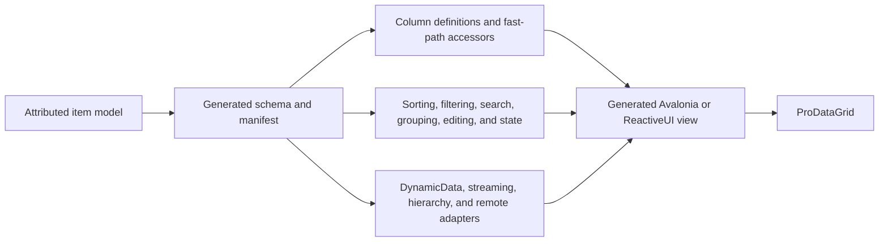

# ProDataGrid source generators

`ProDataGrid.SourceGenerators` produces reflection-free grid schemas, typed data-operation adapters, application controllers, and optional Avalonia or ReactiveUI views. Generated code uses direct delegates and compiled Avalonia binding metadata, so the same contracts work with trimming and NativeAOT.

This page is the entry point for the complete source-generator documentation. The former expansion specification has been replaced by task-focused articles that describe the implemented APIs.

## What the generator can own



The generated schema is the canonical source for column keys, typed fields, item identity, operation delegates, transfer metadata, analytics roles, and persisted-state compatibility. This prevents individual features from rediscovering properties with reflection or adopting incompatible key conventions.

The generator does not own domain rules, persistence, networking, authentication, retry policy, visual branding, arbitrary formula evaluation, or application-specific shells. Those remain user code behind typed interfaces and customization hooks.

## Start here

| Goal | Article |
| --- | --- |
| Install the analyzer and generate a first grid | [Getting started and schema discovery](source-generators/getting-started.md) |
| Configure column kinds, typed fields, fast paths, and runtime shapes | [Schemas, columns, accessors, and manifests](source-generators/schemas-and-columns.md) |
| Generate sorting, filtering, searching, grouping, summaries, paging, and controllers | [Operations and controllers](source-generators/operations-and-controllers.md) |
| Connect DynamicData, async streams, channels, snapshots, or remote data | [Reactive, streaming, and remote data](source-generators/reactive-streaming-remote.md) |
| Generate tree metadata, filtering, expansion, and wrapper-aware bindings | [Hierarchical data](source-generators/hierarchy.md) |
| Preserve selection, current cell, layout, and state by stable key | [Selection, navigation, and state](source-generators/selection-navigation-state.md) |
| Generate stack, uniform-grid, wrap, or custom model-based row/item-template layouts | [Generated layouts](source-generators/layouts.md) |
| Generate editing, validation, undo, clipboard, fill, formatting, and drag/drop adapters | [Editing and data workflows](source-generators/editing-and-data-workflows.md) |
| Configure bands, indexed columns, templates, details, direct cells, and drawing | [Layout, templates, and rendering](source-generators/layout-templates-rendering.md) |
| Generate pivot, outline, formula, and chart metadata | [Analytics and formulas](source-generators/analytics-and-formulas.md) |
| Generate code-only Avalonia and ReactiveUI views | [Generated views](source-generators/generated-views.md) |
| Apply assembly policies, registries, DI, custom implementations, and base classes | [Registries and customization](source-generators/registries-and-customization.md) |
| Configure localization, automation, diagnostics, performance, AOT, and tests | [Accessibility, diagnostics, and validation](source-generators/diagnostics-performance-testing.md) |
| Look up every generator attribute and important option | [Attribute reference](source-generators/attribute-reference.md) |
| Find complete sample and production-validation scenarios | [Samples and production validation](source-generators/samples-and-production-validation.md) |

## Minimal example

Reference the generator as a private analyzer dependency:

```xml
<ItemGroup>
  <PackageReference Include="ProDataGrid" />
  <PackageReference Include="ProDataGrid.SourceGenerators"
                    PrivateAssets="all" />
</ItemGroup>
```

Describe the row contract and augment a partial ViewModel:

```csharp
using ProDataGrid.SourceGeneration;

[GenerateDataGridColumns(
    ProviderName = "TradeGridSchema",
    SchemaId = "trading/trade/v1",
    Strict = true)]
public sealed class Trade
{
    [DataGridKey]
    [DataGridColumn(DataGridColumnKind.Numeric,
        Header = "ID", ColumnKey = "trade-id", Order = 0,
        IsReadOnly = true)]
    public int Id { get; init; }

    [DataGridColumn(DataGridColumnKind.Text,
        Header = "Symbol", ColumnKey = "trade-symbol", Order = 1,
        Width = "2*")]
    public string Symbol { get; init; } = string.Empty;

    [DataGridColumn(DataGridColumnKind.Numeric,
        Header = "Price", ColumnKey = "trade-price", Order = 2,
        FormatString = "N2")]
    public decimal Price { get; init; }
}

[GenerateDataGridViewModel(typeof(Trade), ProviderName = "TradeGridSchema")]
public sealed partial class TradesViewModel
{
    public IReadOnlyList<Trade> Items { get; } = LoadTrades();
}
```

Bind the generated members with compiled XAML bindings:

```xml
<DataGrid ItemsSource="{Binding Items}"
          ColumnDefinitionsSource="{Binding ColumnDefinitions}"
          FastPathOptions="{Binding FastPathOptions}"
          AutoGenerateColumns="False" />
```

The generated ViewModel members are `DataGridSchema`, `ColumnDefinitions`, and `FastPathOptions`. Their names are configurable.

## Feature coverage

All major feature families from the expansion design are implemented. The table maps the original feature identifiers to their user documentation.

| Feature | Implemented capability | Documentation |
| --- | --- | --- |
| F01 | Isolated incremental discovery, deterministic emission, compatibility manifest | [Getting started](source-generators/getting-started.md), [validation](source-generators/diagnostics-performance-testing.md) |
| F02 | Stable keys, typed item indexes, reference and composite identity | [Schemas and columns](source-generators/schemas-and-columns.md) |
| F03–F04 | Typed descriptors, presets, operation models, named controllers and commands | [Operations and controllers](source-generators/operations-and-controllers.md) |
| F05–F07 | DynamicData, bounded streams, snapshot reconciliation, revisioned remote queries | [Reactive, streaming, and remote data](source-generators/reactive-streaming-remote.md) |
| F08 | Hierarchy metadata, wrapper-aware bindings, filtering, async expansion | [Hierarchical data](source-generators/hierarchy.md) |
| F09 | Typed grouping and rendered or incremental summaries | [Operations and controllers](source-generators/operations-and-controllers.md) |
| F10–F11 | Stable-key selection, current cell, navigation, state capture and migration | [Selection, navigation, and state](source-generators/selection-navigation-state.md) |
| F12–F14 | Editing, conversion, validation, undo, clipboard, fill, conditional formatting | [Editing and data workflows](source-generators/editing-and-data-workflows.md) |
| F15–F16 | Bands, chooser/layout, indexed columns, templates, row details, custom drawing | [Layout, templates, and rendering](source-generators/layout-templates-rendering.md) |
| F17 | Keyed flat and hierarchical drag/drop adapters | [Editing and data workflows](source-generators/editing-and-data-workflows.md) |
| F18 | Pivot, outline, chart and formula metadata and adapters | [Analytics and formulas](source-generators/analytics-and-formulas.md) |
| F19 | Code-only Avalonia/ReactiveUI views, recipes, events and interactions | [Generated views](source-generators/generated-views.md) |
| F20 | Localization, automation metadata and diagnostics manifests | [Accessibility, diagnostics, and validation](source-generators/diagnostics-performance-testing.md) |
| F21 | Collection views, paging/currency, mutation services and runtime-defined shapes | [Operations and controllers](source-generators/operations-and-controllers.md), [schemas and columns](source-generators/schemas-and-columns.md) |
| F22 | Filter-editor metadata, distinct values and cached header commands | [Operations and controllers](source-generators/operations-and-controllers.md) |
| F23 | Performance profiles, input maps, navigation and renderer metric sinks | [Accessibility, diagnostics, and validation](source-generators/diagnostics-performance-testing.md) |
| F24 | Drawn/direct realization, transactional selection/cell events, hierarchy-aware filtering and expansion | [Layout and rendering](source-generators/layout-templates-rendering.md), [generated views](source-generators/generated-views.md), [hierarchy](source-generators/hierarchy.md) |

## Generated layers

The public generation surface has four cooperating layers:

1. **Schema generation** produces immutable field metadata, stable identity, fresh mutable column-definition lists, operation compilers, and runtime factories.
2. **ViewModel augmentation** exposes selected schema artifacts on an existing partial type without requiring a particular ViewModel base class.
3. **Controller generation** owns operation models, pipelines, state, commands, errors, completion, and disposal for a named grid.
4. **View generation** creates an optional C# control tree with compiled binding indexers. Avalonia and ReactiveUI strategies share the same schema and controller contracts.

Assembly and namespace policies are optional compilation-wide coordination features. Direct type/property attributes remain in isolated incremental pipelines and do not enumerate unrelated source types.

## Customization precedence

When an extensible feature offers more than one path, the effective precedence is:

1. An explicit implementation or factory type.
2. A validated static factory/configuration method or generated protected factory override.
3. The generated default.
4. A compatible runtime fallback only when strict mode permits it.

Property metadata overrides type-level configuration; type requests override namespace defaults; namespace defaults override assembly defaults. Invalid or ambiguous combinations produce `PDGSG` diagnostics instead of silently switching to reflection.

## Related documentation

- [Column definitions](column-definitions.md)
- [AOT-friendly column bindings](column-definitions-aot.md)
- [Fast-path overview](column-definitions-fast-path-overview.md)
- [Optimized retained and drawn cells](optimized-cell-paths.md)
- [DynamicData streaming](dynamicdata-streaming-sourcelist.md)
- [Hierarchical data](hierarchical-data.md)
- [State persistence](state-persistence.md)
- [Metrics and activities](metrics-and-activities.md)
